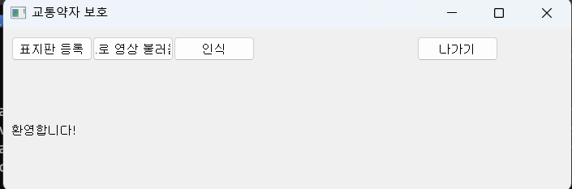
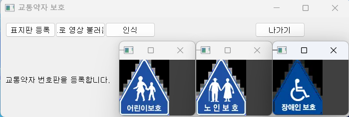
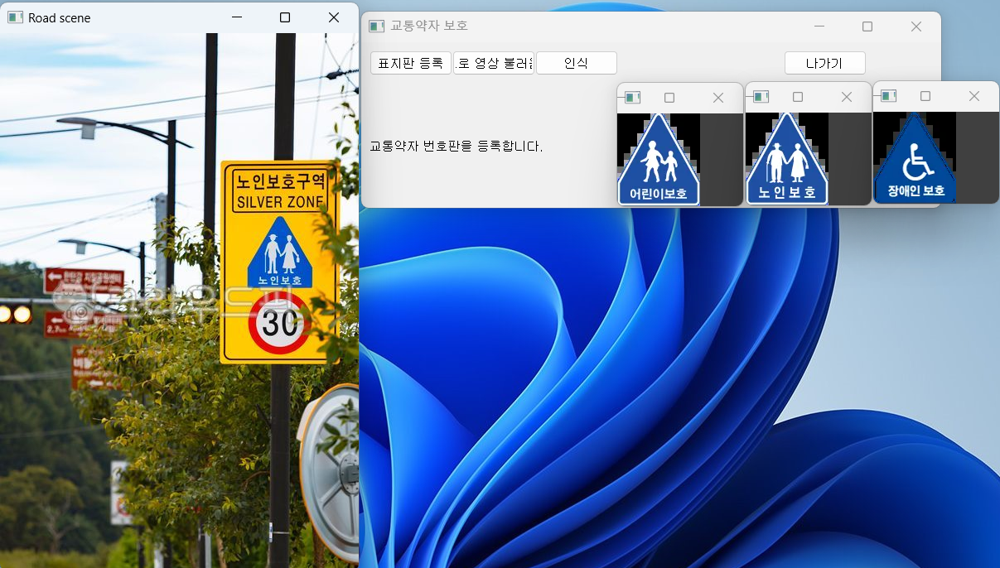
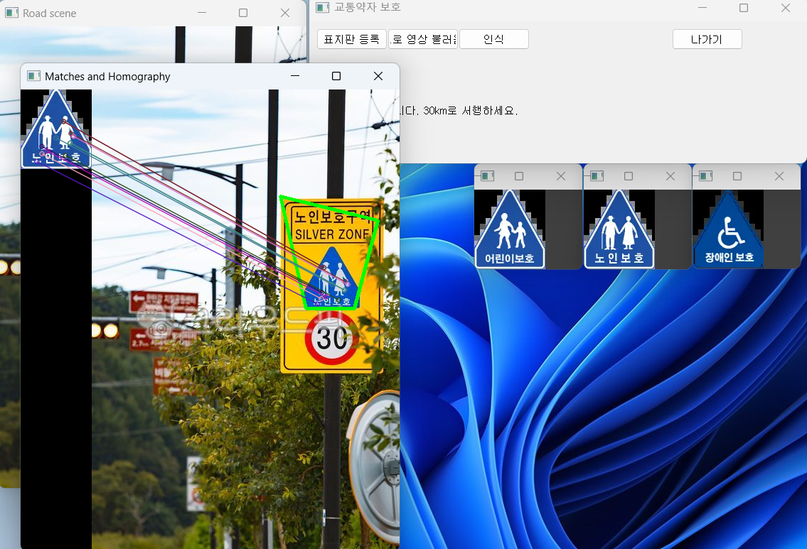

# [비전에이전트2] 6.4 교통약자 보호구역 알림 모델 구현
-----------
1. ### 개발환경 구축

```
mkdir vision_agent4
git clone "https://github.com/biskt/visionproject.git"
conda activate 이름
```
환경을 만든 다음 vscode로 폴더를 열어서 준비를 마친다.

--------

2. ### 개발 목적
이 모델을 만드는 목적은 교통약자(어린이, 노인, 장애인 등)의 안전을 더욱 신경써야하는 구간을 나타내는 표지판들을 컴퓨터 비전 기술로 인식한 후 운전자에게 알려주는 기술을 활용해 교통약자의 사고율을 줄이는 것이다. 미디어에서 보이는 교통약자 표지판을 인식해주는 기술을 활용한다.

---------

3. ### 구현 내용
```
class TrafficWeak(QMainWindow):
    def __init__(self):
        super().__init__()
        # 윈도우 제목,위치,크기 설정
        self.setWindowTitle('교통약자 보호')
        self.setGeometry(200,200,700,200)
       
        # 버튼 4개, 레이블 1개 생성 
        signButton=QPushButton('표지판 등록',self)
        roadButton=QPushButton('도로 영상 불러옴',self)
        recognitionButton=QPushButton('인식',self)
        quitButton=QPushButton('나가기',self)
        self.label=QLabel('환영합니다!',self)
        
        # 버튼 클릭 시 수행할 콜백 함수 지정
        signButton.setGeometry(10,10,100,30)
        roadButton.setGeometry(110,10,100,30)
        recognitionButton.setGeometry(210,10,100,30)
        quitButton.setGeometry(510,10,100,30)
        self.label.setGeometry(10,40,600,170)
        
        signButton.clicked.connect(self.signFunction)
        roadButton.clicked.connect(self.roadFunction) 
        recognitionButton.clicked.connect(self.recognitionFunction)        
        quitButton.clicked.connect(self.quitFunction)

        self.signFiles=[['child.png','어린이'],['elder.png','노인'],['disabled.png','장애인']]	# 표지판 모델 영상 이름 설정
        self.signImgs=[]
```
먼저 ui를 생성하고 준비된 표지판 이미지 파일들을 지정하고 영상에 저장할 객체를 생성한다.

```
 def signFunction(self):
        self.label.clear()
        self.label.setText('교통약자 번호판을 등록합니다.')
        
        for fname,_ in self.signFiles:
            self.signImgs.append(cv.imread(fname))
            cv.imshow(fname,self.signImgs[-1])
```
표지판 등록 버튼를 실행할 콜백 함수이다.
```
def roadFunction(self):
        if self.signImgs==[]:
            self.label.setText('먼저 번호판을 등록하세요.')
        else:
            fname=QFileDialog.getOpenFileName(self,'파일 읽기','./')
            self.roadImg=cv.imread(fname[0])
            if self.roadImg is None: sys.exit('파일을 찾을 수 없습니다.')  
    
            cv.imshow('Road scene',self.roadImg)
```
도로영상 불러오는 버튼이다. 그 다음은 인식 버튼이다.
```
KD=[]
            for img in self.signImgs: 
                gray=cv.cvtColor(img,cv.COLOR_BGR2GRAY)
                KD.append(sift.detectAndCompute(gray,None))
```
KD에 표지판 사진 3개의 특징점과 기술자 정보를 추출해서 저장한다.
```
grayRoad=cv.cvtColor(self.roadImg,cv.COLOR_BGR2GRAY)
            road_kp,road_des=sift.detectAndCompute(grayRoad,None)
            
            matcher=cv.DescriptorMatcher_create(cv.DescriptorMatcher_FLANNBASED)
            GM=[]
            for sign_kp,sign_des in KD:
                knn_match=matcher.knnMatch(sign_des,road_des,2)
                T=0.7
                good_match=[]
                for nearest1,nearest2 in knn_match:
                    if (nearest1.distance/nearest2.distance)<T:
                        good_match.append(nearest1)
                GM.append(good_match)
            
            best=GM.index(max(GM,key=len))
```
그 특징점과 기술자 정보를 이용해서 도로 영상과 매칭을 반복해서 좋은 매칭 리스트를 가져온다.
```
self.label.setText(self.signFiles[best][1]+' 보호구역입니다. 30km로 서행하세요.')
                winsound.Beep(3000,500)
```
어떤 보호구역인지 알려주고 비프음을 들려주며 운전자에게 주의를 준다.

---------

4. 실행

실행을 하면 사진과 같이 UI가 생기고 표지판 등록을 눌러 등록된 사진 3가지를 띄운다.

그 다음 운전 영상을 첨부한다.

그 다음 인식을 누른다.

마지막으로 인식을 하는 창이 나오고 서행운전하라는 말이 나온다.